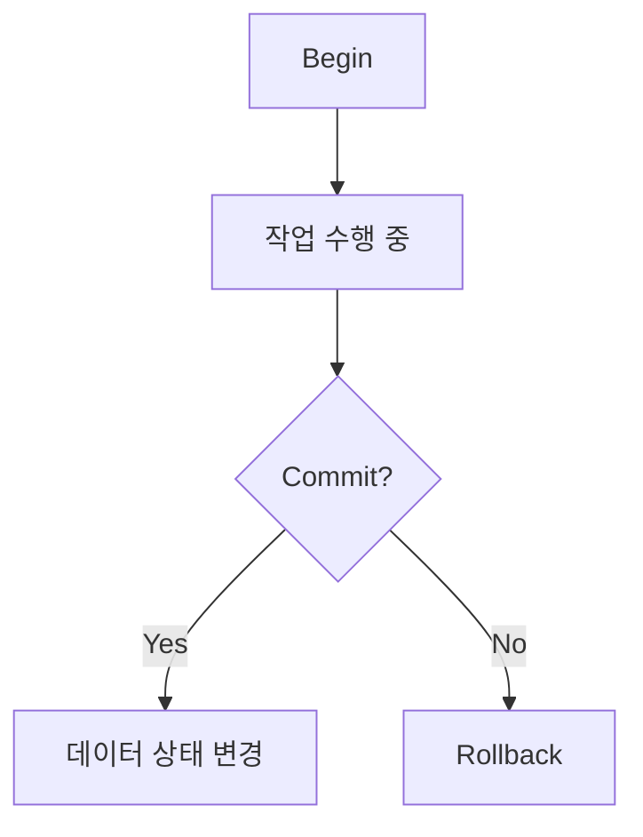

- 여러 작업을 하나의 논리적인 작업으로 실행하는 기능
- 트랜잭션 안에서 작업되는 데이터는 commit 전까지 변경되면 안된다. 다른 코드를 실행할 때 영향을 미친다.

## transaction의 요소: begin, commit, rollback
### Begin
- 트랜잭션의 시작을 나타냅니다. 데이터베이스에서 여러 작업을 수행하기 위해 트랜잭션을 시작할 때 사용됩니다. 이 시점부터 모든 작업은 하나의 단위로 묶여 처리되며, 중간 상태가 외부에 노출되지 않습니다.
### Commit
트랜잭션에서 수행한 모든 작업을 영구적으로 저장하는 과정입니다. commit이 수행되면, 트랜잭션 내의 모든 변경 사항이 데이터베이스에 반영되고, 다른 사용자나 트랜잭션이 해당 변경 사항을 볼 수 있게 됩니다. 즉, 트랜잭션이 성공적으로 완료되었다는 의미입니다.

### Rollback
트랜잭션에서 수행한 작업을 모두 취소하고, 데이터베이스를 트랜잭션 시작 이전 상태로 되돌리는 과정입니다. 오류가 발생하거나 트랜잭션이 실패할 경우 사용됩니다. 이를 통해 데이터의 일관성을 유지할 수 있습니다.




## transaction의 문제점
### lost reads
- 두 트랜젝션이 같은 데이터를 업데이트해서 하나의 업데이트가 손실되는 경우
#### 예제 sql
```sql
-- 1.테이블 생성
CREATE TABLE Account (
    id INT PRIMARY KEY,
    balance DECIMAL(10, 2)
);

-- 계좌에 100원 입력
INSERT INTO Account (id, balance) VALUES (1, 100.00); 

-- 2. 트렌잭션 A: 계좌의 잔액을 일고 업데이트
-- 트랜잭션 A 시작
BEGIN;

-- 잔액 읽기
SELECT balance FROM Account WHERE id = 1;   -- 잔액: 100.00

-- 잔액 업데이트
UPDATE Account SET balance = balance + 50.00 WHERE id = 1;  -- 잔액: 150.00

-- 트랜잭션 A 커밋
COMMIT;

-- 3. 트랜잭션 B: 동일한 계좌의 잔액을 읽고 업데이트
-- 트랜잭션 A의 업데이트 반영 전이라고 가정한다.
-- 트랜잭션 B 시작
BEGIN;

-- 잔액 읽기
SELECT balance FROM Account WHERE id = 1;   -- 잔액: 100.00 (트랜잭션 A의 업데이트 반영 전)

-- 잔액 업데이트
UPDATE Account SET balance = balance - 30.00 WHERE id = 1;  -- 잔액: 70.00

-- 트랜잭션 B 커밋
COMMIT;

```
- 트랜잭션 A가 완료되기 전에 트랜잭션 B가 발생한 경우(동시성), 트랜잭션 A의 업데이트는 손실되고 트랜잭션 B만 남게 된다.
#### 예제 해결방안
- Optimistic Lock(비관적 락) 전략으로 해결 가능

### dirty reads
- 아직 commit되지 않은 값을 트랜젝션이 읽는 경우
#### 예제 sql
```sql
-- 1. 테이블 생성:
CREATE TABLE Account (
    id INT PRIMARY KEY,
    balance DECIMAL(10, 2)
);

INSERT INTO Account (id, balance) VALUES (1, 100.00);

-- 2. 트랜잭션 A: 잔액 업데이트 (아직 커밋되지 않음)
-- 트랜잭션 A 시작
BEGIN;

-- 잔액 읽기
SELECT balance FROM Account WHERE id = 1;   -- 잔액: 100.00

-- 잔액 업데이트 (아직 커밋되지 않음)
UPDATE Account SET balance = balance + 50.00 WHERE id = 1;  -- 잔액: 150.00

-- 3. 트랜잭션 B: 트랜잭션 A의 변경 사항을 읽음 (커밋되지 않은 데이터)
-- 트랜잭션 B 시작
BEGIN;

-- 트랜잭션 A의 커밋되지 않은 잔액 읽기 (더티 리드)
SELECT balance FROM Account WHERE id = 1;   -- 잔액: 150.00 (트랜잭션 A의 변경 사항)

-- 잔액 업데이트
UPDATE Account SET balance = balance - 30.00 WHERE id = 1;  -- 잔액: 120.00

-- 트랜잭션 B 커밋
COMMIT;

-- 4. 트랜잭션 A 커밋 또는 롤백:
-- 트랜잭션 A 커밋
COMMIT;  -- 또는 ROLLBACK; (트랜잭션 B에서 읽은 데이터가 무효가 될 수 있음)

```
- 만약 트랜잭션 A가 롤백된다면, 트랜잭션 B의 업데이트는 잘못된 데이터에 기반하여 수행된 것이므로 데이터의 일관성이 깨지게 됩니다. 이로 인해 "Dirty Reads" 문제가 발생합니다.
#### 해결방안
- read commited 트랜잭션으로 해결
### non-repeatable reads
- 한 트랜젝션에서 데이터를 두번 읽을때 다른 결과가 나오는 경우
#### 예제 sql
```sql
-- 테이블 생성
CREATE TABLE Account (
    id INT PRIMARY KEY,
    balance DECIMAL(10, 2)
);

-- 초기 데이터 삽입
INSERT INTO Account (id, balance) VALUES (1, 100.00);

-- 트랜잭션 A 시작
BEGIN;

-- 첫 번째 잔액 읽기
SELECT balance FROM Account WHERE id = 1;   -- 잔액: 100.00

-- 트랜잭션 B 시작
BEGIN;

-- 잔액 업데이트
UPDATE Account SET balance = balance + 50.00 WHERE id = 1;  -- 잔액: 150.00

-- 트랜잭션 B 커밋
COMMIT;

-- 트랜잭션 A에서 두 번째 잔액 읽기
SELECT balance FROM Account WHERE id = 1;   -- 잔액: 150.00

-- 트랜잭션 A 커밋
COMMIT;
```
#### 해결방안
- repeatable read 트랜잭션으로 해결한다.
### phantom reads
- 여러 row를 불러오는 필터링 쿼리를 진행 후 다른 트랜잭션에서 쿼리의 조건에 맞는 새로운 데이터를 생성했을때 같은 쿼리가 다른 결과를 반환하는걸 이야기한다.
- 첫 read 이후에 다른 트랜잭션 데이터를 추가한 경우
```sql
-- 테이블 생성
CREATE TABLE Products (
    id INT PRIMARY KEY,
    name VARCHAR(50),
    price DECIMAL(10, 2)
);

-- 초기 데이터 삽입
INSERT INTO Products (id, name, price) VALUES (1, 'Product A', 100.00);
INSERT INTO Products (id, name, price) VALUES (2, 'Product B', 150.00);

-- 트랜잭션 A 시작
BEGIN;

-- 첫 번째 읽기: 가격이 120.00 이상인 제품 조회
SELECT * FROM Products WHERE price >= 120.00;   -- 결과: Product B

-- 트랜잭션 B 시작
BEGIN;

-- 새로운 제품 추가
INSERT INTO Products (id, name, price) VALUES (3, 'Product C', 130.00);  -- 가격이 130.00

-- 트랜잭션 B 커밋
COMMIT;

-- 트랜잭션 A에서 두 번째 읽기
SELECT * FROM Products WHERE price >= 120.00;   -- 결과: Product B, Product C

-- 트랜잭션 A 커밋
COMMIT;

```
#### 해결방안
- serializable 트랜잭션으로 해결 가능하다.


